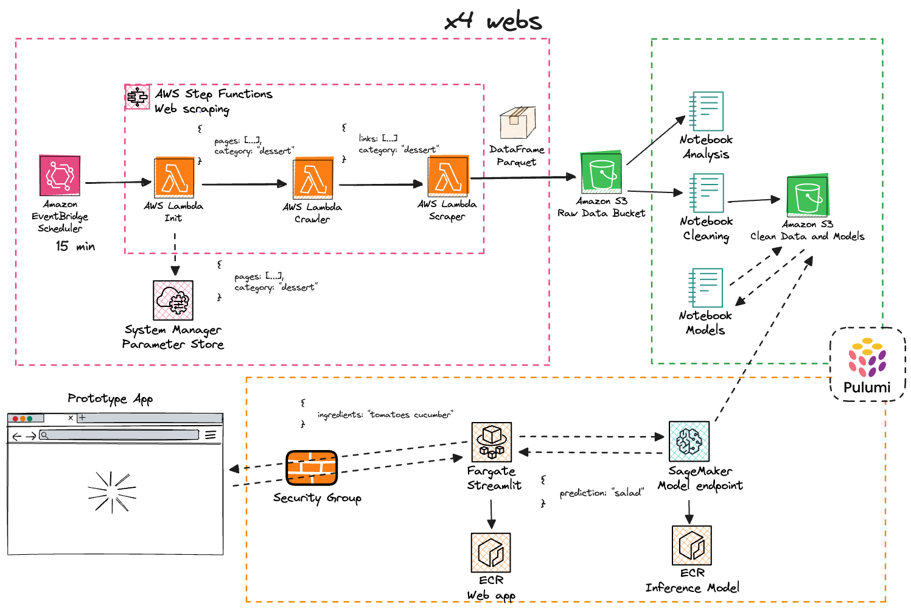
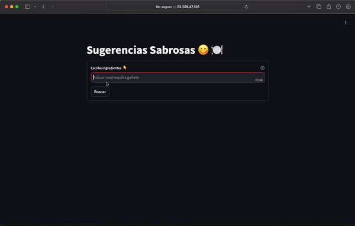

# Mini Lago ML App de Recetas

Trabajo Fin de Máster CIDAEN. Creación de un lago de datos de recetas desplegado en AWS con el objetivo de crear una aplicación
para clasificar y sugerir recetas de cocina en base a una serie de ingredientes

## Arquitectura

Toda la infraestructura de servicios desplegada está ilustrada en la siguiente figura

Los tres pilares sobre los que se basa el diseño del sistema:
- Extracción de datos en modo serverless con lambdas y orquestación con stepfunctions
- Procesamiento de datos, entrenamiento y evaluación de modelos en instancia Jupyter de Sagemaker
- Despliegue de modelo y servicio web

## Estructura del proyecto

Cada una de los componentes que conforman el sistema se corresponde con una carpeta. Dentro de ella, se distinguen los scripts con la lógica implementada y por otro lado una subcarpeta denominada "infraestructura". En esta última se encuentran los proyectos de Pulumi con toda la definición de servicios y configuraciones a desplegar en AWS.

## Demo

Dado que se trata de un prototipo, no se quiere gastar dinero innecesariamente dejando que la aplicación esté siempre disponible. No obstante, se puede ver una demo sencilla con un GIF de cómo funciona la aplicación final.

# Referencias

Durante el desarrollo ha habido ciertos artículos y experiencias de otros desarrolladores que me han valido para inspirarme y tambien solucionar 
grandes dudas sobre cómo hacer ciertas partes. Aquí va una lista:

- [AWS SageMaker Tutorial](https://www.datacamp.com/tutorial/aws-sagemaker-tutorial)
- [Deploying custom inference images on SageMaker](https://medium.com/latinxinai/deploying-custom-inference-images-on-sagemaker-the-easy-way-13d760a690e4)
- [Working with text data](https://scikit-learn.org/stable/tutorial/text_analytics/working_with_text_data.html)
- [Multi-Class Text Classification with Scikit-Learn](https://towardsdatascience.com/multi-class-text-classification-with-scikit-learn-12f1e60e0a9f)

